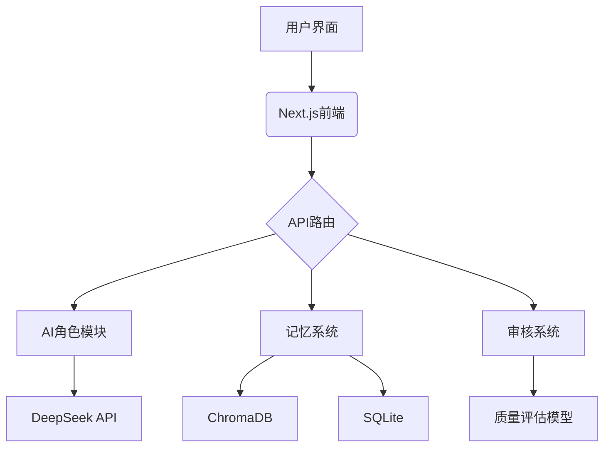

### **MVP 方案**

---

#### **一、核心目标**

开发本地运行的 AI 小说创作助手，实现：

1. 用户与多个 AI 角色（故事构建者/对话生成者/情节推进者）协同创作
2. 保持对话上下文持续性（非简单聊天记录）
3. 质量导向审核（逻辑/文风/观赏度）
4. 人工修改建议的实时反馈闭环

---

### **二、技术架构**



---

### **三、技术栈**

| 模块           | 技术方案                          | 关键优势              |
| -------------- | --------------------------------- | --------------------- |
| **前端框架**   | Next.js 14 (App Router)           | 全栈能力/本地开发友好 |
| **UI 组件库**  | shadcn/ui + TailwindCSS + iconify | 轻量级/高定制化       |
| **AI 推理**    | DeepSeek API                      | 混合模型支持          |
| **向量存储**   | ChromaDB                          | 嵌入式/零配置         |
| **结构化存储** | SQLite                            | 单文件存储            |
| **协同编辑**   | Tiptap Lite                       | 轻量富文本支持        |

---

### **四、核心模块实现**

#### 1. **AI 角色协作系统**

```typescript
// 角色路由逻辑
export async function roleHandler(role: string, prompt: string) {
  const modelRouter = {
    "world-builder": "deepseek-chat",
    "dialogue-generator": "local-novel-ai",
    "plot-driver": "deepseek-chat",
  };

  const response = await ollama.generate({
    model: modelRouter[role],
    prompt: `${roleContext[role]}${prompt}`,
    options: { temperature: 0.7 },
  });

  return response;
}
```

#### 2. **对话记忆系统**

```python
# 记忆检索增强
def get_related_memories(query: str) -> list:
    # 混合检索策略
    keyword_match = sqlite_search(query)  # 精确匹配
    vector_match = chroma_db.query(query)  # 语义匹配
    return deduplicate(keyword_match + vector_match)

# 记忆压缩存储
def store_memory(text: str):
    if len(text) > 100:
        text = summarizer(text, max_length=100)
    embedding = miniLM.encode(text)
    chroma_db.add(embedding, metadata={'length': len(text)})
```

#### 3. **质量审核模块**

```typescript
// 三级质量评估
async function qualityReview(content: string) {
  const metrics = ["逻辑一致性", "文风匹配度", "观赏度"];
  const prompt = `用0-2分评估以下方面：\n${metrics.join(
    "\n"
  )}\n内容：${content}`;

  const response = await deepseek.chat.completions.create({
    model: "deepseek-chat",
    messages: [{ role: "user", content: prompt }],
    temperature: 0,
  });

  return parseReviewScores(response.choices[0].message.content);
}

// 示例输出解析
("逻辑一致性: 2\n文风匹配度: 1\n观赏度: 2");
```

---

#### 4. **质量审核模块**

- 核心创作流程 > 审核系统 > 记忆管理
- 人工操作优先于全自动化

---

### **五、数据流设计**


---

### **六、本地运行配置**

#### 1. 目录结构

```bash
/novel-ai
  /app
    /api         # Next.js API路由
    /components  # 交互组件
    /lib
      /ai        # 模型接入
      /memory    # 记忆系统
  /data
    chroma       # 向量数据库存储
    novel.db     # SQLite数据库
  /models
    minilm       # 量化嵌入模型
```

### **八、迭代路线**

1. **Phase 1**

   - 实现基础角色协作
   - 完成本地模型集成
   - 开发最小记忆系统

2. **Phase 2**

   - 增加角色参数自定义
   - 实现记忆可视化面板
   - 优化本地资源占用

3. **Phase 3**

   - 添加离线模式支持
   - 内置创作模板库
   - 实现自动备份系统
