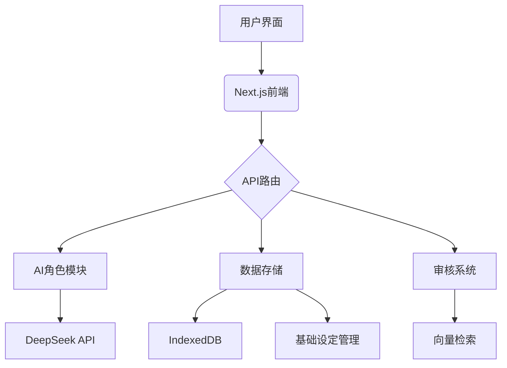
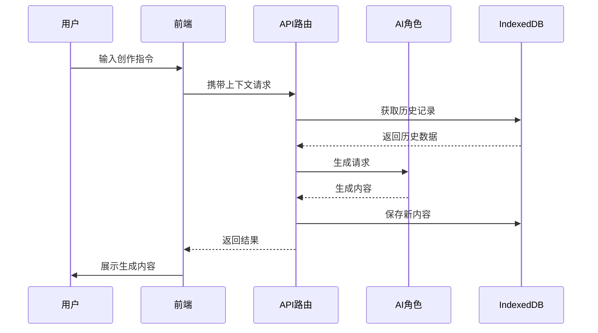

### **优化后的完整 AI 小说创作助手方案**

Tale Weaver 是一个智能写作助手应用，帮助创作者更好地创作和管理他们的故事。

## 功能特点

开发基于 DeepSeek API 的 AI 小说创作助手，实现：

1. **基础设定管理**：

   - 引导式设定创建流程
   - 多维度设定分类（世界观、角色、剧情、魔法体系等）
   - 设定间的智能关联
   - 版本历史追踪

2. **AI 协同创作**：

   - 多角色 AI 顾问团队
   - 基于用户想法的智能建议
   - 实时反馈与修改
   - 设定一致性检查

3. **设定创作流程**：

   - 第一步：用户输入初始想法

     - 提供引导性提示
     - 支持关键词和概要描述
     - 灵活的输入方式

   - 第二步：AI 协作完善

     - 多角色分析和建议
     - 自动关联相关设定
     - 保持设定一致性
     - 实时预览效果

   - 第三步：确认与应用
     - 设定预览和编辑
     - 一键应用建议
     - 版本管理
     - 设定导出

4. **设定类型**：

   - 世界观设定

     - 地理环境
     - 文明发展
     - 社会制度
     - 历史背景

   - 角色设定

     - 性格特征
     - 背景故事
     - 关系网络
     - 成长轨迹

   - 剧情设定

     - 主要冲突
     - 情节发展
     - 转折点
     - 结局设计

   - 魔法体系
     - 基本规则
     - 能力限制
     - 获取方式
     - 进阶体系

5. **智能辅助功能**：
   - 设定一致性检查
   - 逻辑冲突检测
   - 创意拓展建议
   - 细节完善提醒

### 故事管理

- 创建和管理多个故事
- 实时保存故事内容
- 支持故事导出功能
- 自动同步和备份

### AI 辅助写作

- 多角色 AI 助手
  - 编辑：帮助规划和完善故事情节
  - 评审：从读者角度提供反馈
  - 导师：指导写作技巧和风格提升
  - 创意师：激发灵感，提供新的创意方向

### 质量审查

- 故事一致性评分
- 文风匹配度分析
- 趣味性评估
- 智能改进建议

### 技术特点

- 离线优先设计
- IndexedDB 本地存储
- 响应式界面设计
- 深色/浅色主题支持

#### **二、技术架构**



---

#### **三、技术栈**

| 模块      | 技术方案                           | 关键优势                   |
| --------- | ---------------------------------- | -------------------------- |
| 前端框架  | Next.js 14 + React 19              | App Router, 服务端组件     |
| UI 组件库 | shadcn/ui + Tailwind CSS + Iconify | 高度可定制, 主题系统       |
| 图标库    | iconify                            | -                          |
| 状态管理  | React Context + TypeScript         | 类型安全, 上下文共享       |
| 数据存储  | SQL.js + Dexie.js (IndexedDB)      | 本地持久化, 结构化查询     |
| 向量检索  | @xenova/transformers               | 轻量级文本向量化, 离线支持 |
| API 集成  | DeepSeek Chat API                  | 中文优化, 上下文理解       |

---

#### **四、核心功能**

1. **多角色协作**

   - 故事构建者：世界观和主线设定
   - 对话生成者：角色对话创作
   - 情节推进者：剧情发展和转折

2. **记忆系统**

   - 基于向量的语义检索
   - 本地持久化存储
   - 混合查询策略

3. **质量控制**

   - 实时文本分析
   - 多维度评估
   - 修改建议生成

4. **基础设定管理**

   - 按照小说名称分类管理
   - 各类设定、大纲、章节等必要元素

   1. **数据结构**

   ```typescript
   // 基础设定数据结构
   interface Setting {
     id: string;
     storyId: string;
     type: "world" | "character" | "plot" | "magic-system";
     content: string;
     updatedAt: number;
     version?: number;
   }

   // 设定历史记录
   interface SettingHistory {
     id: string;
     settingId: string;
     content: string;
     version: number;
     createdAt: number;
   }

   // 设定元数据
   interface SettingMetadata {
     tags?: string[];
     references?: {
       type: string;
       id: string;
       title: string;
     }[];
     status: "draft" | "review" | "final";
   }
   ```

   2. **功能模块**

   ```mermaid
   graph TD
       A[基础设定管理] --> B[新增设定]
       A --> C[编辑设定]
       A --> D[删除设定]
       A --> E[导入设定]
       A --> F[导出设定]
       B --> G[保存至IndexedDB]
       C --> G
       D --> H[从IndexedDB删除]
       E --> I[解析导入文件]
       F --> J[生成导出文件]
   ```

---

#### **五、数据流设计**



1. **本地存储层**
   - IndexedDB: 向量数据和设置
   - SQL.js: 结构化数据
2. **内存缓存层**

   - 向量存储：Map 实现
   - 会话状态：Context 管理

3. **API 交互层**
   - 异步请求处理
   - 错误重试机制
   - 数据同步策略

---

#### **六、迭代路线**

1. **Phase 1**

   - 实现基础角色协作
   - 完成 DeepSeek API 集成
   - 搭建 IndexedDB 存储

2. **Phase 2**

   - 增加角色参数自定义
   - 实现历史记录管理
   - 优化 API 调用效率

3. **Phase 3**

   - 实现基础设定管理
   - 按照小说名称分类管理
   - 各类设定、大纲、章节等必要元素

4. **Phase 4**

   - 添加协同编辑功能
   - 内置创作模板库
   - 实现自动备份系统

---
